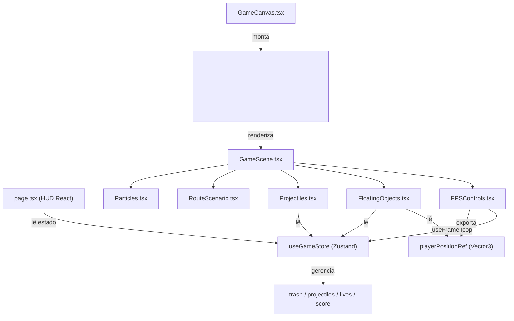

# 🐋 Whale Doom: Operação Ressurgência — Documentação Técnica

> Jogo de navegação 3D no navegador em primeira pessoa (FPV), inspirado esteticamente no *Doom*, mas ambientado nas profundezas do oceano real de **Arraial do Cabo, RJ**. O jogador controla uma baleia que sobe do fundo do mar destruindo poluição no caminho até as águas rasas.

---

## Índice

1. [Visão Geral do Projeto](#1-visão-geral-do-projeto)
2. [Stack de Tecnologias](#2-stack-de-tecnologias)
3. [Infraestrutura & Execução](#3-infraestrutura--execução)
4. [Estrutura de Arquivos](#4-estrutura-de-arquivos)
5. [Arquitetura do Jogo](#5-arquitetura-do-jogo)
6. [Componentes 3D (detalhado)](#6-componentes-3d-detalhado)
7. [Estado Global — useGameStore](#7-estado-global--usegamestore)
8. [Controles e Física](#8-controles-e-física)
9. [Sistema de Seções / Mapa](#9-sistema-de-seções--mapa)
10. [HUD e Interface (page.tsx)](#10-hud-e-interface-pagetsx)
11. [Fluxo de Jogo Completo](#11-fluxo-de-jogo-completo)

---

## 1. Visão Geral do Projeto

**Whale Doom** é um jogo FPS 3D rodando 100% no navegador, construído com React e WebGL (via Three.js). Não possui backend; toda a lógica roda no cliente.

### Premissa Narrativa
A baleia **Whale** acorda nas profundezas do Mar Aberto de Cabo Frio e precisa subir até as águas rasas de Arraial do Cabo destruindo detritos de poluição marinha. O percurso é linear (eixo Z negativo) e dividido em **4 seções geográficas** reais da costa brasileira, cada uma com estética e obstáculos diferentes.

### Mecânicas Centrais
| Mecânica | Descrição |
|---|---|
| **Movimento FPV** | WASD + Mouse + Espaço/Shift para nadar em 3D |
| **Canhão de Bolhas** | Clique esquerdo dispara projéteis de alta velocidade |
| **Detritos (Demônios)** | 40 items estáticos espalhados pelas seções; ao toque causam 1 de dano |
| **Vidas (Casco)** | 3 vidas; ao perder todas → Game Over |
| **Vitória** | Alcançar o portal em Z ≤ -1980 |
| **Pontuação** | +150 pontos por detrito destruído |

---

## 2. Stack de Tecnologias

| Camada | Tecnologia | Versão |
|---|---|---|
| **Framework Web** | Next.js (App Router) | 16.2.6 |
| **UI Library** | React | 19.2.4 |
| **Motor 3D** | Three.js | ^0.184.0 |
| **React 3D Bindings** | @react-three/fiber | ^9.6.1 |
| **Extras 3D** | @react-three/drei | ^10.7.7 |
| **Estado Global** | Zustand | ^5.0.13 |
| **CSS / Estilização** | TailwindCSS | ^4 |
| **Ícones** | lucide-react | ^1.16.0 |
| **Linguagem** | TypeScript | ^5 |
| **Runtime Node** | Node.js (Alpine) | 20 |

### Por que React Three Fiber?
O **R3F** (React Three Fiber) transforma componentes React em chamadas Three.js. Isso permite declarar a cena 3D como JSX, integrando naturalmente ao ciclo de vida do React e ao Zustand store para sincronizar estado de jogo com os objetos 3D.

---

## 3. Infraestrutura & Execução

### Docker (recomendado para desenvolvimento)

```bash
# Subir ambiente de desenvolvimento containerizado
docker-compose up -d --build

# Parar e remover volumes
docker-compose down -v
```

O container roda `npm run dev` com hot-reload na porta **3000**.

**Dockerfile:**
```dockerfile
FROM node:20-alpine
WORKDIR /app
COPY package.json package-lock.json ./
RUN npm install --legacy-peer-deps
COPY . .
EXPOSE 3000
ENV PORT 3000
ENV HOSTNAME "0.0.0.0"
CMD ["npm", "run", "dev"]
```

### Desenvolvimento Local

```bash
npm install --legacy-peer-deps
npm run dev     # Servidor de desenvolvimento (Turbopack)
npm run build   # Build de produção + checagem TypeScript
npm run lint    # ESLint
```

---

## 4. Estrutura de Arquivos

```
whale-doom-operacao-ressurgencia/
├── src/
│   ├── app/
│   │   ├── layout.tsx          # Root layout HTML, metadata SEO, fontes
│   │   ├── page.tsx            # Tela principal: HUD, menus, overlays, banners
│   │   └── globals.css         # Variáveis CSS globais e animações
│   │
│   ├── components/
│   │   └── 3d/
│   │       ├── GameCanvas.tsx      # Wrapper do <Canvas> R3F
│   │       ├── GameScene.tsx       # Raiz da cena 3D (luzes, fog, stars)
│   │       ├── FPSControls.tsx     # Motor de movimento + colisões + câmera
│   │       ├── RouteScenario.tsx   # Geometria estática de todo o mapa
│   │       ├── FloatingObjects.tsx # Detritos (inimigos), renderização + colisão
│   │       ├── Projectiles.tsx     # Renderização das bolhas disparadas
│   │       ├── Particles.tsx       # Partículas de plâncton flutuante
│   │       └── Player.tsx          # Re-exporta playerPositionRef
│   │
│   ├── hooks/
│   │   └── useKeyboard.ts      # Hook para captura de teclado (WASD/Espaço/Shift)
│   │
│   └── store/
│       └── useGameStore.ts     # Estado global Zustand: score, vidas, projéteis, lixo
│
├── Dockerfile
├── docker-compose.yml
├── next.config.ts
├── package.json
└── tsconfig.json
```

---

## 5. Arquitetura do Jogo



### Fluxo de dados por frame (useFrame)
1. `FPSControls.tsx` roda **`updateWorld(delta)`** → move projéteis, detecta hits em lixo
2. `FPSControls.tsx` calcula nova posição da câmera com física e colisões
3. `FPSControls.tsx` chama **`updateSection(z)`** → atualiza seção e trigger de naufrágio
4. `FPSControls.tsx` escreve em `playerPositionRef` (ref compartilhada global)
5. `FloatingObjects.tsx` lê `playerPositionRef` e checa colisão com detritos → **`damagePlayer()`**

---

## 6. Componentes 3D (detalhado)

### `GameCanvas.tsx`
Wrapper mínimo. Monta o `<Canvas>` do React Three Fiber com:
- **FOV**: 60°
- **Near/Far**: 0.1 / 1000
- **Sombras**: ativadas (`shadows`)
- Posição inicial da câmera: `[0, 4, 12]`

---

### `GameScene.tsx`
Raiz declarativa da cena. Define a atmosfera visual global:

| Elemento | Descrição |
|---|---|
| `<color>` | Cor de fundo `#020617` (azul-marinho escuro) |
| `<fog>` | Névoa linear de profundidade (near: 10, far: 160) |
| `<ambientLight>` | Luz ambiente ciano `#0891b2` (simula difusão subaquática) |
| `<directionalLight>` | Raios de sol vindos de cima `#a5f3fc`, com sombras |
| `<pointLight>` x2 | Luzes bioluminescentes azul e roxo |
| `<Stars>` | 1500 "estrelas" do Drei tratadas como plâncton profundo |
| `<Particles>` | 400 partículas ciano flutuando com ondas sinusoidais |

---

### `FPSControls.tsx`
**O componente mais complexo do jogo.** Gerencia toda a física de movimento e colisão.

#### Exportações
```typescript
export const playerPositionRef = { current: new THREE.Vector3(0, 0, 0) }
```
Ref global compartilhada com `FloatingObjects` e `Player`. Não usa estado React para evitar re-renders.

#### Sistemas internos

**Sistema de Movimento (useFrame)**
```
Camera Direction → WASD → moveVec → nextPos
```
- `forwardVec`: direção de onde a câmera aponta
- `rightVec`: perpendicular calculado via cross product
- Espaço = `moveVec.y += 1.0` | Shift = `moveVec.y -= 1.0`
- Velocidade: **18 unidades/s** (normalizado × delta para framerate independente)

**Física do Chão Diagonal (Seabed)**
O mapa é uma rampa inclinada. O Y do chão cresce com Z negativo:
```typescript
const floorY = -45 + (-nextPos.z * 0.22);   // slope: 0.22 y por unidade z
const minPlayerY = floorY + 2.5;             // player radius
const maxPlayerY = floorY + 68.0;            // teto do corredor submarino
```

**Sistema de Colisores Estáticos (`OBSTACLES`)**
Array de objetos colisores que o jogador não pode atravessar. Três tipos:

| Tipo | Campos | Detecção |
|---|---|---|
| `cylinder` | `x, z, radius` | Distância XZ < radius + playerRadius |
| `sphere` | `x, y, z, radius` | Distância 3D < radius + playerRadius |
| `box` | `xMin/xMax, yMin/yMax, zMin/zMax` | AABB overlap + push no eixo de menor penetração |

Colisores registrados:
- 4 pilares cilíndricos (Seção 2, Paredões do Pontal)
- 3 corais esféricos (Seção 4, Arraial)
- 2 pilares do portal (Z = -1980)
- 2 caldeiras do Vapor Harlingen + 1 box (rib cage) (Z = -1780)

**Disparo de Bolhas (mousedown)**
```typescript
// Apenas quando pointer lock está ativo
const dir = camera.getWorldDirection(...)
shootBubble(origin, [dir.x, dir.y, dir.z])
```

---

### `RouteScenario.tsx`
Define **toda a geometria estática do mapa** usando primitivas Three.js. Não usa assets externos — tudo é geometria procedural.

#### Seções do Mapa

| Seção | Z Range | Y médio | Elementos |
|---|---|---|---|
| **1 — Mar Aberto** | 30 a -450 | ~-35 | Chão plano escuro |
| **2 — Paredões do Pontal** | -450 a -1000 | ~120 | 4 pilares cilíndricos enormes |
| **3 — Estreito do Boqueirão** | -1000 a -1600 | ~246 | Paredes de cânion + arcos rochosos |
| **4 — Arraial do Cabo** | -1600 a -2000 | ~361 | Chão dourado, corais, Vapor Harlingen, portal |

#### Chão Diagonal (4 planos inclinados)
Cada seção tem um `<planeGeometry>` inclinado com `rotation={[-Math.PI/2 + slopeAngle, 0, 0]}` onde `slopeAngle = Math.atan(0.22)`. O Y do centro de cada plano segue a fórmula da rampa.

#### Naufrágio Histórico — Vapor Harlingen (Z = -1780)
Cargueiro alemão afundado em 1906, representado como detritos desmontados:
- 2 caldeiras cilíndricas enferrujadas com corais-cérebro
- 3 arcos de "cavernas" (costelas do casco) em ferro oxidado
- Caixas de carga apodrecidas
- Chapas metálicas espalhadas na areia
- Cardume de 6 peixes bioluminescentes ciano

#### Animação Dinâmica de Cor (useFrame)
A cor do fundo e da névoa interpola suavemente com base na posição Z do jogador:
```typescript
const deepColor   = new THREE.Color("#020617"); // azul escuro profundo
const shallowColor = new THREE.Color("#0e7490"); // turquesa cristalino
const pct = clamp((playerZ - 0) / (-2000 - 0), 0, 1);
scene.background = deepColor.lerp(shallowColor, pct);
```
A névoa também fica mais clara e mais distante nas águas rasas.

---

### `FloatingObjects.tsx`
Renderiza e detecta colisão dos 40 detritos de poluição.

**Tipos de Detrito**

| Tipo | Geometria | Cor | Visual |
|---|---|---|---|
| `toxic-barrel` | `CylinderGeometry` + 2 tori | Amarelo tóxico `#eab308` | Barril industrial com anéis verdes radioativos |
| `plastic-bag` | `DodecahedronGeometry` | Roxo `#a855f7` | Blob translúcido e brilhante |
| `scrap-metal` | `BoxGeometry` | Vermelho `#ef4444` | Bloco de metal enferrujado |

**Colisão Player ↔ Detritos**
```typescript
const dist = sqrt(dx² + dy² + dz²);
if (dist < trash.hitRadius + 1.2) {
  damagePlayer(1);
  invulnTimeRef = 1.5s; // período de invulnerabilidade
}
```

---

### `Projectiles.tsx`
Renderiza as bolhas ativas do store. Cada bolha é uma `SphereGeometry` ciano com:
- `emissiveIntensity: 3.0` (brilho intenso)
- `blending: AdditiveBlending` (efeito luminoso aditivo)
- `opacity: 0.7` (semi-transparente)

A lógica de movimento e detecção de hit fica em `useGameStore.updateWorld()`.

---

### `Particles.tsx`
400 partículas de plâncton/bolhas usando `<points>` (mais performático que 400 meshes):
- Posições geradas via `Float32Array` no `useMemo`
- Cada partícula deriva suavemente via `Math.sin/cos` com offsets aleatórios
- `depthWrite: false` + `AdditiveBlending` para o efeito bioluminescente

---

### `Player.tsx`
Arquivo mínimo — apenas re-exporta `playerPositionRef` de `FPSControls`:
```typescript
export { playerPositionRef } from "./FPSControls";
```
Existe para desacoplar semanticamente a "posição do jogador" dos controles.

---

## 7. Estado Global — useGameStore

Criado com **Zustand** (store funcional sem Context API).

### Interfaces de Dados

```typescript
interface TrashItem {
  id: number;
  position: [number, number, number];
  type: "toxic-barrel" | "plastic-bag" | "scrap-metal";
  size: number;
  hitRadius: number;
}

interface ProjectileItem {
  id: number;
  position: [number, number, number];
  velocity: [number, number, number];
  life: number; // segundos restantes de vida
}
```

### Estado Completo

| Campo | Tipo | Descrição |
|---|---|---|
| `score` | `number` | Pontuação acumulada |
| `lives` | `number` | Vidas restantes (0-3) |
| `boost` | `number` | Reserva de stamina (0-100) |
| `isPlaying` | `boolean` | Jogo ativo |
| `isGameOver` | `boolean` | Derrota |
| `isGameWon` | `boolean` | Vitória |
| `isPaused` | `boolean` | Pausado (pointer unlock) |
| `trash` | `TrashItem[]` | Detritos vivos no mapa |
| `projectiles` | `ProjectileItem[]` | Bolhas em voo |
| `currentSection` | `number` | Seção atual (1-4) |
| `sectionNotification` | `object \| null` | Banner de entrada de seção |
| `nearShipwreck` | `boolean` | Jogador perto do Vapor Harlingen |

### Actions Principais

**`startGame()`** — Inicializa partida:
- Reseta score, vidas, boost
- Chama `generateDistributedTrash()` → 40 detritos distribuídos nas 4 seções
- Ativa notificação da Seção 1

**`generateDistributedTrash()`** — Geração procedural:
```typescript
// 10 detritos por seção
// Y calculado pela fórmula da rampa: slopeY = -35 + (-z * 0.22)
// Seção 3 (cânion): xRange reduzido para ±15 (corredor estreito)
```

**`shootBubble(origin, direction)`** — Rate limit de 200ms entre disparos:
```typescript
const speed = 70; // unidades/s
velocity = direction * speed;
life = 2.0s;
```

**`updateWorld(delta)`** — Loop principal de física (chamado por FPSControls a cada frame):
1. Move todos os projéteis: `pos += vel * delta`
2. Decrementa `life` de cada projétil
3. Detecta hit (distância 3D) entre projéteis e detritos
4. Remove projéteis que deram hit ou expiraram
5. Remove detritos atingidos
6. Soma `+150 pts` por detrito destruído

**`updateSection(z)`** — Determina seção atual e condições especiais:
- Compara Z com `SECTIONS[i].threshold` para identificar seção
- Dispara `sectionNotification` ao mudar de seção
- Ativa `nearShipwreck = true` quando `z ∈ [-1825, -1735]`
- Condição de vitória: `z ≤ -1980`

---

## 8. Controles e Física

### `useKeyboard.ts`
Hook simples que mantém um `boolean` por tecla usando `keydown`/`keyup`:

| Tecla | Ação |
|---|---|
| `W` / `↑` | forward |
| `S` / `↓` | backward |
| `A` / `←` | left |
| `D` / `→` | right |
| `Espaço` | up (nadar para cima) |
| `Shift` | down (nadar para baixo) |

### PointerLock
Gerenciado pelo componente `<PointerLockControls>` do Drei:
- **Lock** (clique na tela) → `isPaused = false`, mira livre 360°
- **Unlock** (ESC) → `isPaused = true`, overlay de pausa exibido

O `page.tsx` sincroniza o estado `isLocked` via `document.addEventListener('pointerlockchange')`.

### Limites de Movimento

| Eixo | Limite |
|---|---|
| **Y (vertical)** | `floorY + 2.5` até `floorY + 68` (relativo à rampa) |
| **X (lateral)** | ±72 unidades (geral) / ±21.5 (no cânion Z∈[-1600,-1000]) |
| **Z (profundidade)** | max: 30 / min: -2000 |

---

## 9. Sistema de Seções / Mapa

```
Z = 30 (início)                                         Z = -2000 (fim)
│                                                               │
▼ ──── Seção 1 ──── ─── Seção 2 ─── ── Seção 3 ── ─ Seção 4 ─ ▼
  Mar Aberto         Paredões do      Estreito do    Arraial do
  (Cabo Frio)        Pontal           Boqueirão      Cabo
  Z: 0 a -450        Z: -450 a -1000  Z: -1000       Z: -1600
                                      a -1600         a -2000

  Y ≈ -35            Y ≈ 50-134       Y ≈ 160-290    Y ≈ 295-395
  Chão escuro        Pilares coloss.  Cânion estreito Areia dourada
                                      + arcos         + corais
                                                      + Harlingen
                                                      + Portal
```

### Seção 4 — Elementos Especiais
- **Naufrágio Vapor Harlingen** (Z = -1780): trigger educativo + colisores
- **Portal de Chegada** (Z = -1980): 2 pilares + arco emissivos em ciano `#22d3ee`
- **Condição de Vitória**: chegar em Z ≤ -1980

---

## 10. HUD e Interface (`page.tsx`)

O arquivo `page.tsx` é 100% React (sem Three.js). Toda a UI é sobreposta à `<Canvas>` via `position: absolute`.

### Camadas de UI (z-index)

| Elemento | Visibilidade | Z-Index |
|---|---|---|
| **Crosshair** | `isPlaying && isLocked && !isPaused` | 10 |
| **HUD (casco, score, debris)** | `isPlaying && !isGameOver` | 10 |
| **Overlay de pausa / unlock** | `isPlaying && (!isLocked \| isPaused)` | 20 |
| **Notificação de seção** | entrada em nova seção (5.5s) | 30 |
| **Banner Naufrágio** | `nearShipwreck` | 30 |
| **Tela de início** | `!isPlaying && !isGameOver` | 20 |
| **Game Over** | `isGameOver` | 20 |
| **Vitória** | `isGameWon` | 20 |

### Glassmorphism Design
Todos os painéis usam o padrão:
```css
backdrop-blur-xl bg-slate-900/80 border border-cyan-500/40 rounded-2xl shadow-2xl
```

### Banner do Naufrágio (Histórico)
Exibido quando `nearShipwreck = true`, com estilo âmbar dourado, conta a história real do **Vapor Harlingen** (cargueiro alemão afundado em 1906 na Ilha dos Porcos, Arraial do Cabo).

---

## 11. Fluxo de Jogo Completo

```
[Tela de Início]
     │ clique "INICIAR"
     ▼
startGame() → gera 40 detritos → isPlaying = true
     │
     ▼
[Gameplay Loop] ──────────────────────────────────────────────────────┐
     │                                                                │
     ├─ useFrame (FPSControls)                                        │
     │    ├─ updateWorld(delta)   → move bolhas, detecta hits         │
     │    ├─ calcula nextPos      → física, colisores estáticos       │
     │    ├─ updateSection(z)     → seção, naufrágio, vitória         │
     │    └─ playerPositionRef    → compartilha posição               │
     │                                                                │
     ├─ useFrame (FloatingObjects)                                    │
     │    └─ checa dist player↔detritos → damagePlayer(1) se < range │
     │                                                                │
     ├─ mousedown                                                     │
     │    └─ shootBubble() → novo projétil no store                   │
     │                                                                │
     └─────────────────────── loop ───────────────────────────────────┘
          │                        │
          ▼                        ▼
    [lives = 0]              [z ≤ -1980]
    isGameOver = true        isGameWon = true
          │                        │
          ▼                        ▼
   [Tela Game Over]       [Tela Operação Concluída]
          │                        │
          └──── resetGame() ───────┘
                     │
                     ▼
             [Tela de Início]
```
